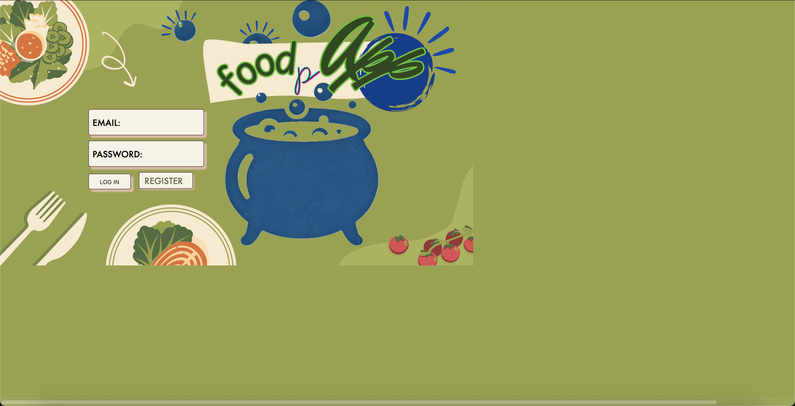
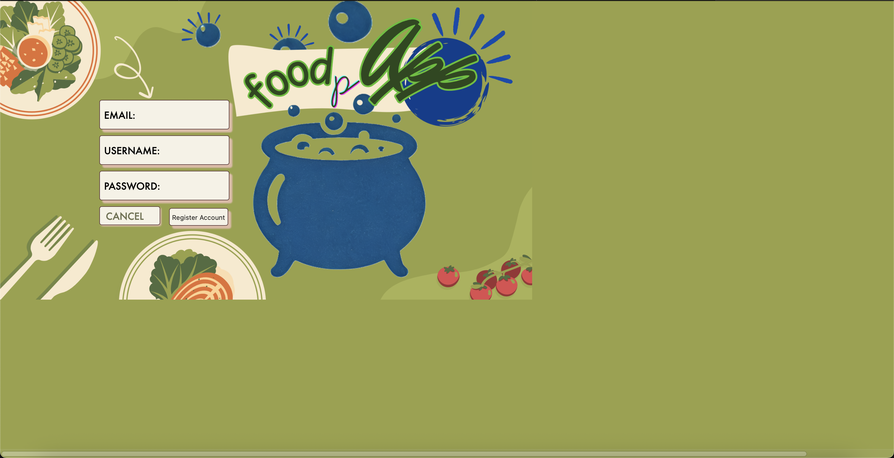
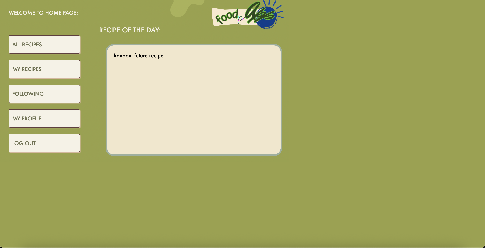
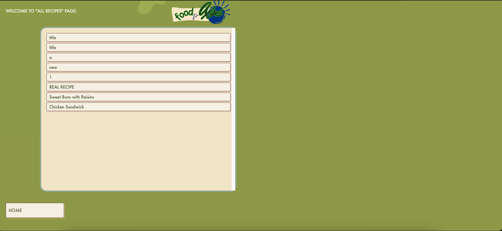
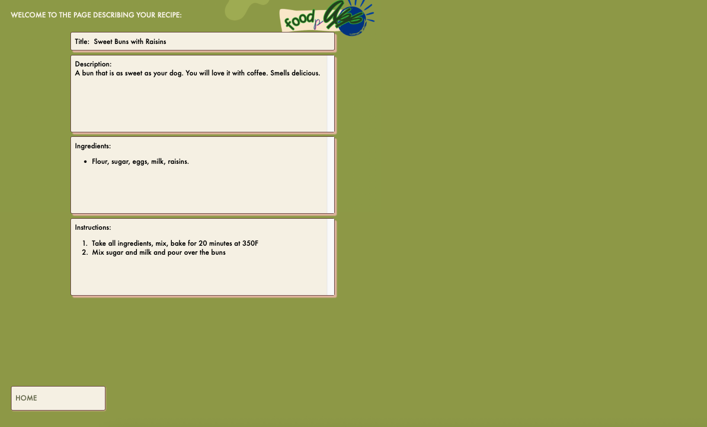
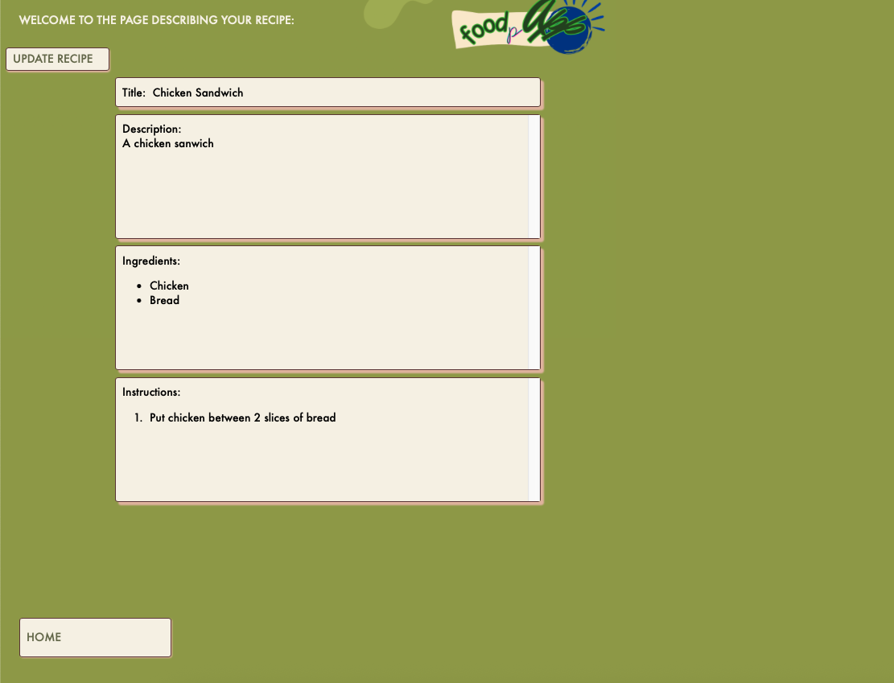
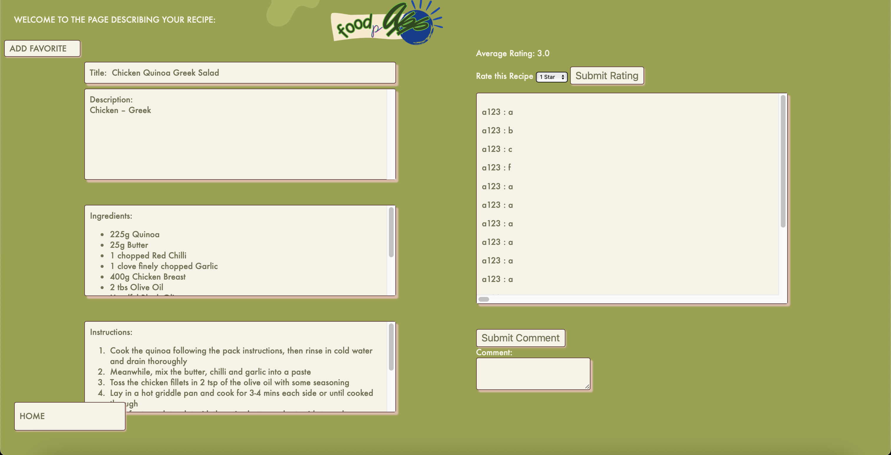
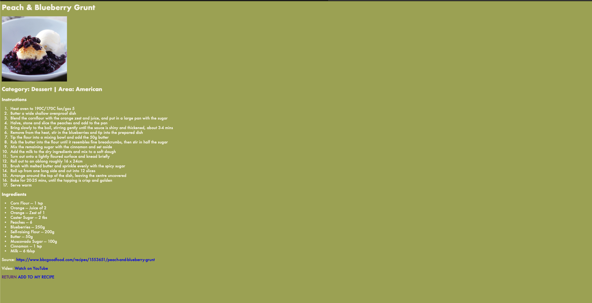

# 🍽️ FOODpApp

A collaborative recipe-sharing web application created by:

- **Le Duy Nguyen** [@LeDuyNg](https://github.com/LeDuyNg)
- **Angelina Ryabechenkova** [@angelinary](https://github.com/angelinary)
- **Jason Nguyen** [@sionide](https://github.com/sionide)

---

## 🚀 Milestone 3 Updates

### ✅ Summary
- Completed 18 functional requirements.
---

## 🛠️ Individual Contributions

**Summary of implemented requirements:**
- **Le Duy Nguyen:** 1, 2, 3, 11, 12, 13, 16, 17, 18
- **Angelina Ryabechenkova:** 7, 8, 14, 15
- **Jason Nguyen:** 4, 5, 6, 9, 10

---

### **Le Duy Nguyen**

**Implemented:**
- A visitor can create an account by providing a username, email, and password.  
- Registered users can log in using their email and password.  
- Logged-in users can log out of their account securely.  
- Users can view their own profile, including their submitted recipes.  
- Users can update their display name, email, or password.  
- Users can save or 'favorite' recipes for quick access later.  
- User can get a randomly generated recipe.  
- User is able to delete their profile and all of their recipes will be auto-deleted.  
- User can see a random recipe of the day on the homepage.  

### **Angelina Ryabechenkova**

**Developed and refined UI design.**  
**Handled ethics-related discussions and documentation.**

**Implemented:**
- Anyone can view the details of a recipe including ingredients and instructions.  
- Users can search recipes by title or ingredient keywords.  
- Homepage or main recipe list shows all recipes available in the database.  
- Users can filter recipes by tags like 'vegan', 'dessert', etc.  

### **Jason Nguyen**

**Implemented:**
- Logged-in users can add new recipes with title, description, ingredients, and instructions.  
- Users can update their own recipes after creation.  
- Users can delete their own recipes.  
- Users can rate a recipe from 1 to 5 stars.  
- Users can leave comments on a recipe.  

---

## 🖥️ Installation and Setup

### Clone the Repository
```bash
git clone https://github.com/LeDuyNg/CMPE-131-Team-2-FOODpApp.git
```

### Create and Activate Virtual Environment

**Linux/MacOS:**
```bash
python3 -m venv venv
source venv/bin/activate
```

**Windows:**
```bash
python -m venv venv
.\venv\Scripts\activate
```

### Install Dependencies

Dependencies are listed in `requirements.txt`. Install them using:
```bash
pip install -r requirements.txt
```

---

## 🌐 Website Usage Guide

### **Initial Launch**
- Navigate to the login page:
  

### **Account Registration**
- Click **Register** to create a new account:
  

### **Logging In**
- After registration, log in using your credentials.

### **Home Page**
- Users are directed here after logging in:
  

### **All Recipes**
- View all recipes stored in the database:
  
- Click any recipe to view details:
  

### **My Recipes**
- Display all recipes created by the logged-in user:
  

### **Recipe Management**
- Owners can edit or delete their own recipes:

  

### **User Profile**
- Profile page includes account information:
  

### **Recipe View**
- Recipe page includes comments and ratings:
  

### **Random Recipe View**
- Recipe from API includes picture, YouTube, source links
  