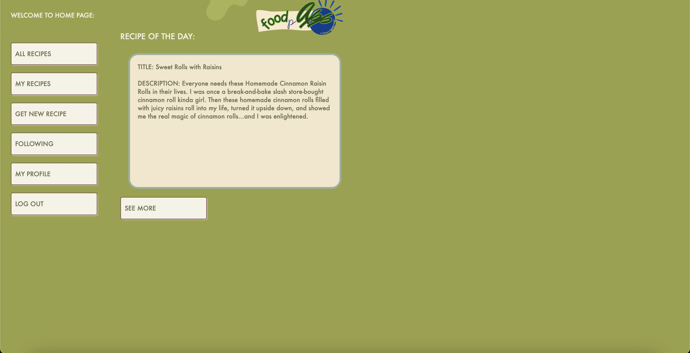

# 🍽️ FOODpApp

A collaborative recipe-sharing web application created by:

- **Le Duy Nguyen** [@LeDuyNg](https://github.com/LeDuyNg)
- **Angelina Ryabechenkova** [@angelinary](https://github.com/angelinary)
- **Jason Nguyen** [@sionide](https://github.com/sionide)

---

## 🚀 Milestone 2 Updates

### ✅ Summary
- Completed 9 functional requirements: **1, 2, 3, 4, 5, 6, 7, 11, 14**.
- Basic user interface implemented.

---

## 🛠️ Individual Contributions

### **Le Duy Nguyen**
- Developed User model.
- Implemented functionalities:
  - User account creation (username, email, password).
  - User login/logout with secure authentication.
- Integrated functionalities with UI.

### **Angelina Ryabechenkova**
- Developed and refined UI design.
- Collaborated with Jason Nguyen to implement:
  - Adding new recipes (title, description, ingredients, instructions).
  - Updating user-created recipes.
- Independently implemented:
  - Viewing detailed recipes (ingredients and instructions).
  - Homepage displaying all available recipes.
- Handled ethics-related discussions and documentation.

### **Jason Nguyen**
- Developed Recipe model.
- Lead developer for functionalities:
  - Adding new recipes.
  - Updating user-created recipes.
  - Deleting user-created recipes.

---

## 🖥️ Installation and Setup

### Clone the Repository
```bash
git clone https://github.com/LeDuyNg/CMPE-131-Team-2-FOODpApp.git
```

### Create and Activate Virtual Environment

**Linux/MacOS:**
```bash
python3 -m venv venv
source venv/bin/activate
```

**Windows:**
```bash
python -m venv venv
.\venv\Scripts\activate
```

### Install Dependencies

Dependencies are listed in `requirements.txt`. Install them using:
```bash
pip install -r requirements.txt
```

---

## 🌐 Website Usage Guide

### **Initial Launch**
- Navigate to the login page:
  

### **Account Registration**
- Click **Register** to create a new account:
  

### **Logging In**
- After registration, log in using your credentials.

### **Home Page**
- Users are directed here after logging in:
  

### **All Recipes**
- View all recipes stored in the database:
  
- Click any recipe to view details:
  

### **My Recipes**
- Display all recipes created by the logged-in user:
  

### **Recipe Management**
- Owners can edit or delete their own recipes:

  

### **User Profile**
- Profile page includes account information:
  

### **Functionalities Status**

| Working ✅                      | Not Working ⚠️           |
|---------------------------------|---------------------------|
| Login/Logout                    | Delete User Profile       |
| Add, Update, Delete Recipes     | Follow Users (Coming soon)|
| View Recipes (All & Personal)   |                           |

