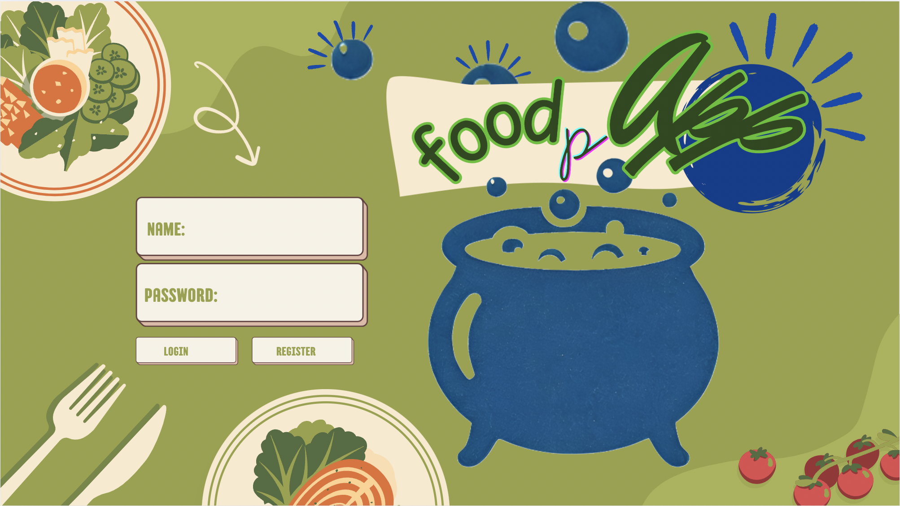
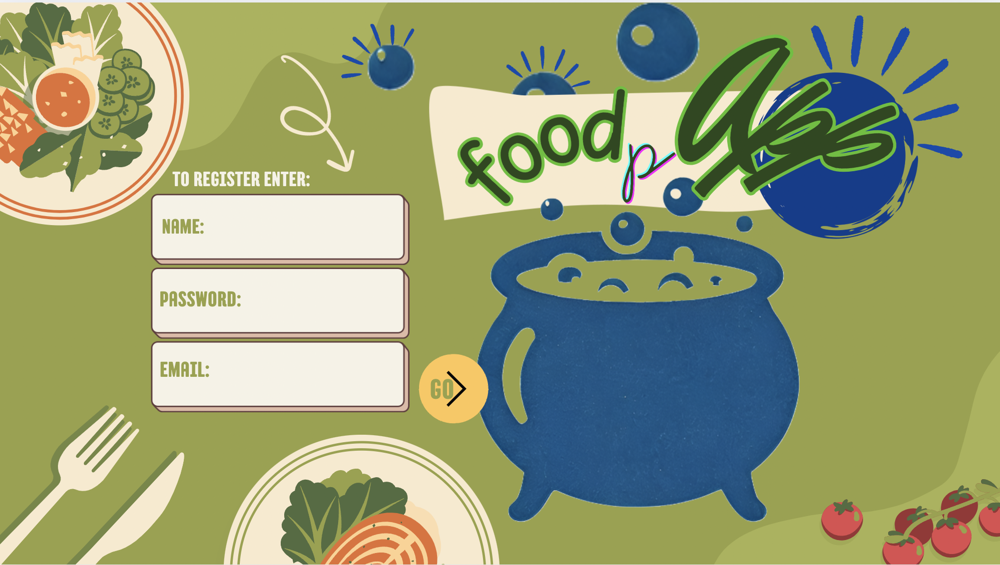
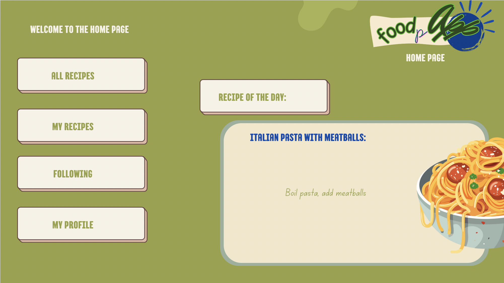
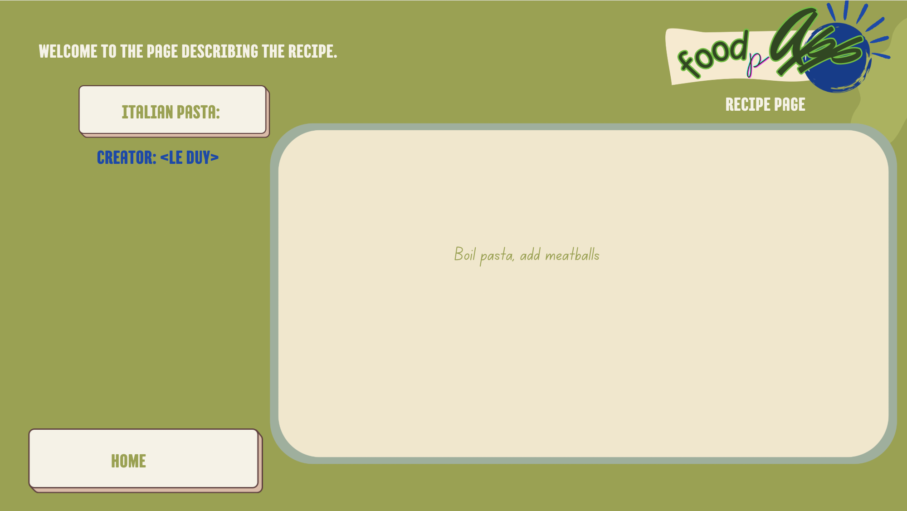
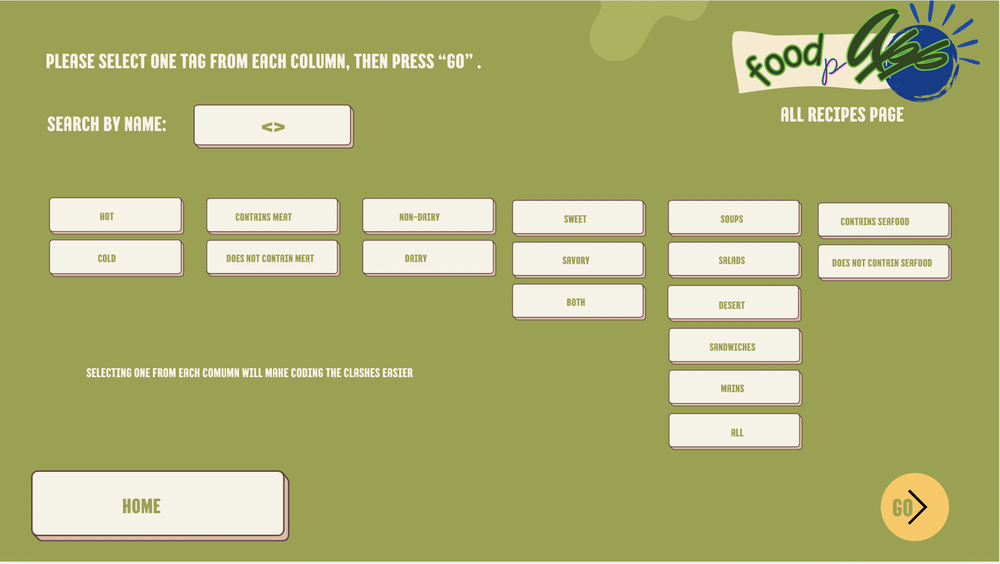
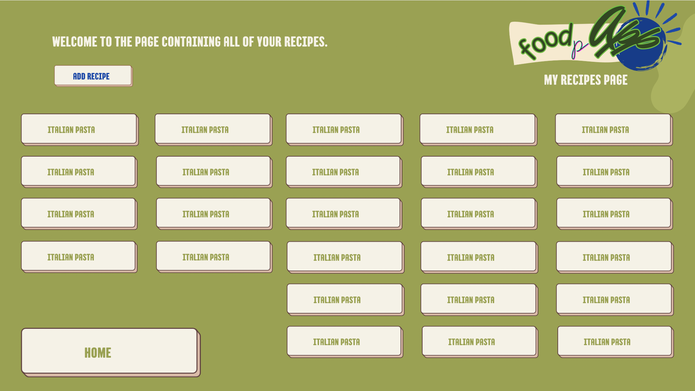
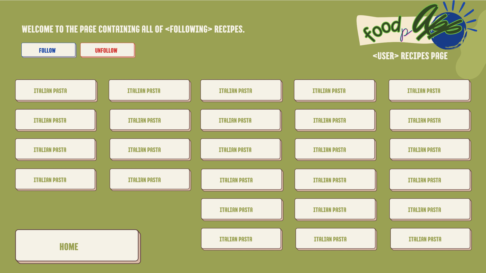
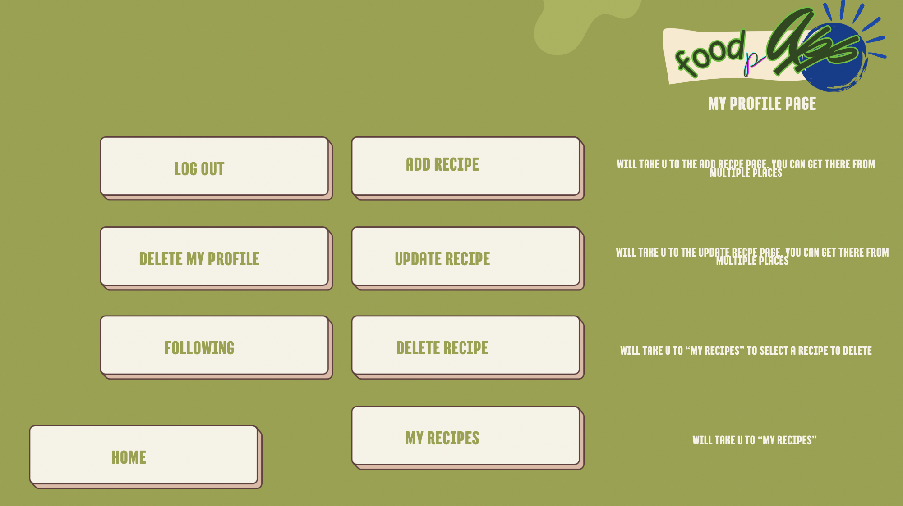
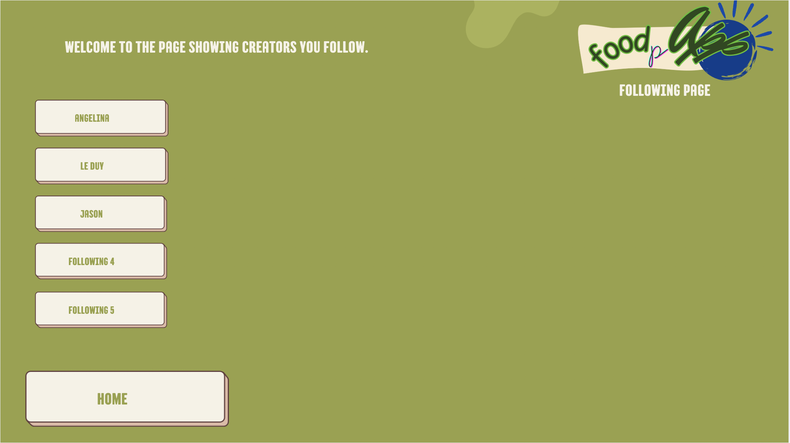

## Functional Requirements
1. A visitor can create an account by providing a username, email, and password.
2. Registered users can log in using their email and password.
3. Logged-in users can log out of their account securely.
4. Logged-in users can add new recipes with title, description, ingredients, and instructions.
5. Users can update their own recipes after creation.
6. Users can delete their own recipes.
7. Anyone can view the details of a recipe including ingredients and instructions.
8. Users can search recipes by title or ingredient keywords.
9. Users can rate a recipe from 1 to 5 stars.
10. Users can leave comments on a recipe.
11. Users can view their own profile, including their submitted recipes.
12. Users can update their display name, email, or password.
13. Users can save or 'favorite' recipes for quick access later.
14. Homepage or main recipe list shows all recipes available in the database.
15. Users can filter recipes by tags like 'vegan', 'dessert', etc.
16. User is logged in can see the profile and recipes of another user.
17. User is able to delete their profile and all of their recipes will be auto deleted.
18. User can set or update one single favorite other user.

## Non-functional Requirements
1. The system must use SQL for the database
2. The system must use Flask as the web framework
## Use Cases

1. **Use Case Name:** User Registration
- **Summary:** A visitor can create an account by providing a username, email, and password.
- **Actor(s):** User, System
- **Pre-condition:** User is on the homepage.
- **Trigger:** User clicks on the **Register an Account** button.
- **Primary Sequence:**

    1. System displays a form for user to fill out to register for new account (fields: email, username, password).
    2. User fills out email field.
    3. System validates email address:
        - Must be a valid format.
        - Must be unique.
    4. User fills out username field.
    5. System validates username:
        - Must be unique.
    6. User fills out password field.
    7. System validates password:
        - Must be at least 8 characters.
    8. System creates a new user account.
    9. System notifies user that a new account has been successfully created.
    10. System stores new user information into database.
    11. System redirect the user to the homepage.

- **Primary Post-conditions:** A new user account is successfully stored into the database.
- **Alternate Sequence:**

    - **2a. User leaves email field empty:**

        - a. System displays an error message warning the user that the email field is empty.

        - b. System prompts user to enter email address.
    
    - **2b. User enters used email address:**

        - a. System displays an error message warning the user that this email address has been used.

        - b. System prompts user to enter a different email address.

    - **2c. User enters invalid email format:**

        - a. System displays an error message warning the user that the user entered an invalid email format.

        - b. System prompts user to enter a different email address.
        
    - **5a. User leaves username field empty:**

        - a. System displays an error message warning the user that the username field is empty.

         - b. System prompts user to enter username.
    
    - **5b. User enters used username:**

        - a. System displays an error message warning the user that this username has been used.

        - b. System prompts user to enter a different username.

    - **7a. User leaves the password field empty:**

        - a. System displays an error message warning the user that the password field is empty.

         - b. System prompts user to enter password.

    - **7b. User enters a password with less than 8 characters:**

        - a. System displays an error message warning the user that the password is too short.

        - b. System prompts user to enter a different password.
    ---
2. **Use Case Name:** User Login
- **Summary:** Registered users can log in using their email and password.
- **Actor(s):** User, System
- **Pre-condition:** User is on the homepage.
- **Trigger:** User clicks on the **Log In** button.
- **Primary Sequence:**
    1. System prompts user to enter email address.
    2. User enters email address.
    3. System validates email address:
        - Must be in a valid format.
        - Must match an existing account.
    4. System prompts user to enter password.
    5. System validates password:
        - Must match the stored password for the given email.
    6. System logs the user in.
    7. System redirect user to homepage.

- **Primary Post-conditions:** User is successfully logged in and redirected to homepage.
- **Alternate Sequence:**
    - **3a. User enters email in invalid format:**

        - a. System displays an error message warning the user that the user entered an invalid email format.

        - b. System prompts user to enter email again.

    - **3b. User enters an email not found in system:**

        - a. System displays an error message warning the user that the user the account doesn't exist.

        - b. System offers option to retry or register a new account.

    - **6a. User enters incorrect password:**

        - a. System displays an error message warning the user that the password is incorrect.

        - b. System prompts the user to retry or reset password.
    ---
3. **Use Case Name:** User Logout
- **Summary:** Logged-in users can log out of their account securely.
- **Actor(s):** User, System
- **Pre-condition:** User is logged in.
- **Trigger:** User clicks on **Log Out** button.
- **Primary Sequence:**
    1. System displays a message indicating the user is about to log out.
    2. System prompts user with 2 options:
        - **Cancel**: Cancel the logout process.
        - **Confirm**: Proceed with logging out.
    3. User clicks **Confirm**.
    5. System logs user out.
    6. System clears user session.
    7. System redirects user homepage.
    8. System displays a message confirming successfully logout.

- **Primary Post-conditions:** User session is terminated, and the user is redirected to the homepage.
- **Alternate Sequence:** 
    - **3a. User clicks "Cancel":**

        - a. System aborts logout process.

        - b. System keeps the user logged in and returns to current view.
    ---
4. **Use Case Name:** Create Recipe
- **Summary:** Logged-in users can add new recipes with title, description, ingredients, and instructions.
- **Actor(s):** User, System
- **Pre-condition:** User is logged in.
- **Trigger:** User clicks on **Add Recipe** button.
- **Primary Sequence:**
    1. System prompts user to enter title of new recipe.
    2. User enters title.
    3. System prompts user to enter description of new recipe.
    4. User enters description.
    5. System prompts user to enter a list of ingredients of new recipe (comma separated).
    6. User enters ingredients.
    7. System prompts user to enter a list of instructions of new recipe (comma separated).
    8. User enters instructions.
    9. System stores new recipe to database.
    10. System redirect user to newly created recipe's detail page.

- **Primary Post-conditions:** A new recipe is stored into the database and viewable on its detail page.
- **Alternate Sequence:**
    - **2a. User leaves title field empty:**
        - a. System displays an error message warning the user that title field is empty.

        - b. System prompts user to enter title.

    - **6a. User leaves ingredients field empty:**
        - a. System displays an error message warning the user that at least one ingredient is required.

        - b. System prompts user to enter ingredients.

    - **8a. User leaves instructions field empty:**
        - a. System displays an error message warning the user that at least one instruction is required.

        - b. System prompts user to enter instructions.
    ---
5. **Use Case Name:** Edit recipe
- **Summary:** Users can update their own recipes after creation.
- **Actor(s):** User, System
- **Pre-condition:** 
    - User is logged in.
    - User is on a the detail page of the recipe to edit.
    - User is the owner of the recipe.
- **Trigger:** User clicks on **Edit Recipe** button.
- **Primary Sequence:**
    1. System loads the existing recipe into an editable form (fields: title, description, ingredients, instructions).
    2. User edits one or more fields.
    3. User submits the updates recipe.
    4. System validates the updates fields:
        - Title, ingredients, instructions must not be empty.
    5. System saves the updated recipe into the database.
    6. System redirects user to the updated recipe's detail page.
    7. System displays a confirmation message indicating the recipe has been successfully updated.

- **Primary Post-conditions:** The recipe is updated and viewable in its detail page.
- **Alternate Sequence:**
    - **3a. User cancels the edit:**
        - a. System discards the changes.
        - b. System redirects user back to the recipe detail page without saving changes.

    - **4a. User leaves one of the required fields empty:**
        - a. System displays an error message warning the user the specific field(s) are empty.

        - b. System prompts user to enter the missing field(s).
    ---
6. **Use Case Name:** Delete Recipe
- **Summary:** Users can delete their own recipes.
- **Actor(s):** User, System
- **Pre-condition:**     
    - User is logged in.
    - User is on the detail page of the recipe to delete.
    - User is the owner of the recipe.
- **Trigger:** User clicks on **Delete Recipe** button.
- **Primary Sequence:**
    1. System displays a confirmation prompt asking the user to confirm deletion.
    2. User clicks **Confirm**.
    3. System deletes the recipe from the database.
    4. System redirects user to their list of recipes.
    5. System displays a confirmation message indicating the recipe has been successfully deleted.

- **Primary Post-conditions:** The recipe is permanently deleted from the database and no longer viewable by any users.
- **Alternate Sequence:**
    - **2a. User clicks "Cancel":**
        - a. System aborts the deletion process.
        - System keeps the user on recipe detail page.
    ---
7. **Use Case Name:** View Recipe
- **Summary:** Anyone can view the details of a recipe including ingredients and instructions.
- **Actor(s):** User, System
- **Pre-condition:** None
- **Trigger:** User clicks on the **Recipe Link** button or types in URL.
- **Primary Sequence:**
    1. System directs user to recipe page
    2. System gets information from DB
    3. System parses information and displays on page

- **Primary Post-conditions:** User is on specific recipe's page
    
    ---
8. **Use Case Name:** Search Recipe
- **Summary:** Users can search recipes by title or ingredient keywords.
- **Actor(s):** User, System
- **Pre-condition:** User is on the Search Page
- **Primary Sequence:**
    1. User types in string from the title
    2. User clicks search
    3. System looks through DB to see if the string is contained in any title
    4. System will then return a link to any recipe that contains the string in the title
    5. User can click on the recipe they're looking for

- **Primary Post-conditions:** User is given a list of recipes from DB
- **Alternate Sequence:**
    - **2a. User has no input:**
        - System displays an error message due to lack of input
    - **5a. No match found in DB:**
        - System displays an error message "recipe not found"
    ---
9. **Use Case Name:** Rate Recipe
- **Summary:** Users can rate a recipe from 1 to 5 stars.
- **Actor(s):** User, System
- **Pre-condition:** User is on a recipe page and logged in
- **Trigger:** User clicks rate recipe
- **Primary Sequence:**
    1. User rates a recipe 1-5 stars
    2. System takes in the rating and adds it to the total rating in DB
    3. System finds new avg with rating from the user
    4. System updates avg rating displayed on page

- **Primary Post-conditions:** The recipe is rating is updated and visible on the recipe page
- **Alternate Sequence:**
    - **1a. User cancels rating:**
        - No rating is applied
    ---
10. **Use Case Name:** Comment on Recipe
- **Summary:** Users can leave comments on a recipe.
- **Actor(s):** User, System
- **Pre-condition:** User is on a recipe page and logged in
- **Trigger:** User clicks **comment** button
- **Primary Sequence:**
    1. User types in comment
    2. User posts comment
    3. System stores comment into DB
    4. System reloads page to display comment

- **Primary Post-conditions:** The recipe page is updated with the comment from the user displayed on the page
- **Alternate Sequence:**
    - **2a. User cancels comment:**
        - No comment is posted
    ---
11. **Use Case Name:** View User Profile
- **Summary:** Users can view their own profile, including their submitted recipes.
- **Actor(s):** User, System
- **Pre-condition:** None
- **Trigger:** User clicks on User or types in URL
- **Primary Sequence:**
    1. User is directed to a User profile
    2. System gets information from DB
    3. System parses and displays information on page

- **Primary Post-conditions:** Selected User's profile will be on a page for display

    ---
12. **Use Case Name:** Edit User Profile
- **Summary:** Users can update their display name, email, or password.
- **Actor(s):** User, System
- **Pre-condition:** User is on self profile page and logged in
- **Trigger:** User clicks **Edit Profile** button
- **Primary Sequence:**
    1. Update page to be editable
    2. User makes changes to available fields
    3. User saves changes
    4. System saves changes into DB
    5. System reloads page with updated information from DB

- **Primary Post-conditions:** User Profile page is updated with new information/changes
- **Alternate Sequence:**
    - **1a. User leaves field empty:**
        - System displays an error message that "One or more fields are incomplete"
    - **2a. User cancels edit:**
        - Changes are discarded
    ---
13. **Use Case Name:** Save Recipe
- **Summary:** Users can save or 'favorite' recipes for quick access later.
- **Actor(s):** User, System
- **Pre-condition:** User is on a recipe page and logged in
- **Trigger:** User clicks **Save Recipe** button
- **Primary Sequence:**
    1. System finds User in DB
    2. System adds Recipe to saved posts
    3. Reload page and display that this post is saved
- **Primary Post-conditions:** User's saved posts are updated and the recipe page displays that the post is already saved

    ---
14. **Use Case Name:** View All Recipes
- **Summary:** User that is logged in can view all recipes in the database
- **Actor(s):** User, System
- **Pre-condition:** User has an account
- **Trigger:** User clicks **Recipes** link
- **Primary Sequence:**
	1. User logs in 
	2. User clicks “recipes” link
	3. System displays all recipes

- **Primary Post-conditions:** User is on the “recipes” page
- **Alternate Sequence:**
    - **3a. Database has no recipes**
		- System displays an error message
    ---
15. **Use Case Name:** Filter Recipes
- **Summary:** User that is logged in can filter all recipes by pre-defined tags
- **Actor(s):** User, System
- **Pre-condition:** User has an account
- **Trigger:** User clicks a specific **Tag** link
- **Primary Sequence:**
	1. User logs in 
	2. User clicks “recipes” link
	3. User clicks on a single recipe
	4. User clicks on a tag
	3. System displays all recipes that include that tag
	
- **Primary Post-conditions:** User can see all recipes that include the chosen tag
- **Alternate Sequence:**
	- **4a. This recipe has no tags:**
		- User has to select a different recipe that has a tag
		
    ---
16. **Use Case Name:** View Another Profile
- **Summary:** User is logged in can see the profile and recipes of another user.
- **Actor(s):** User, System
- **Pre-condition:** More than one user exists
- **Trigger:** User clicks on another user’s username **Tag Name** link
- **Primary Sequence:**
	1. User logs in
	2. User clicks “recipes”
	3. User clicks any particular recipe not created by them
	4. System displays recipe creator’s name
	5. User clicks on the creator’s name
	6. System displays the profile with that user’s recipes

- **Primary Post-conditions:** User can see the recipes of the creator whose name they clicked on
- **Alternate Sequence:**
	- **5a. System has no recipes created by other users, only default ones:**
		- User has to select a different recipe
	---

17. **Use Case Name:** Delete Profile
- **Summary:** User is able to delete their profile and all of their recipes will be auto deleted
- **Actor(s):** User, System
- **Pre-condition:** User has an account, and at least 1 other user exists.
- **Trigger:** User clicks on **Delete My Profile** link
- **Primary Sequence:**
	1. User logs in
	2. User clicks “my profile”
	3. System displays the user’s profile
	4. User clicks “delete my profile”
	5. System deletes their recipes
	6. System deletes user’s profile
	
- **Primary Post-conditions:** User’s profile no longer exists within the system and why will need to re-register to continue using the system.
- **Alternate Sequence:**
	- **1a. User forgot their password:**
		- User resets the password
	---

18. **Use Case Name:** Follow Another Profile
- **Summary:** User can set or update one single favorite other user.
- **Actor(s):** User, System
- **Pre-condition:** More than one user exists
- **Trigger:** User clicks on **Follow** link
- **Primary Sequence:**
	1. User logs in
	2. User clicks “recipes” link
	3. User selects any recipe they want
	4. System shows that recipe’s page with the name of the creator
	5. User clicks on the creator’s name
	6. System takes user to the creator’s profile
	7. User clicks **Follow** link

- **Primary Post-conditions:** User is able to see the recipes of the followed user on “recipes” page above other users recipes 
- **Alternate Sequence:**
	- **1a. User forgot their password:**
		- User resets the password
	- **7a. User does not want to follow and does not click on Follow:**
		- User can click on *My Profile* or *Home* to be taken there.
	- **7b. User clicks *follow* when they already have a follow:**
		- User loses the old follow, because the new one replaces the old one
	-**7c. User clicks “follow” when they are already following that user:**
		- User instead unfollows that user

## Mockups

### Login Page

### Register Page

### Home Page

### Recipe Page

### All Recipes Page

### My Recipes Page

### User's Recipes Page

### User Profile Page

### User Following Page

